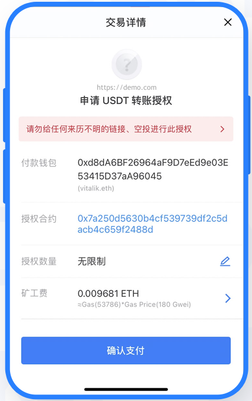

# 区块链安全问题合集

> 🛡️ **BTY链安全研究：从历史漏洞中学习，构建更安全的区块链系统**

## 📋 目录

- [前言](#前言)
- [1. 2010年的BTC通胀漏洞](#1-2010年的btc通胀漏洞)
- [2. 以太坊DDoS攻击：FOMO3D游戏漏洞](#2-以太坊ddos攻击fomo3d游戏漏洞)
- [3. 以太坊重入攻击：The DAO被掏空](#3-以太坊重入攻击the-dao被掏空)
- [4. 警惕剪贴板劫持：一次转账，资产归零](#4-警惕剪贴板劫持一次转账资产归零)
- [5. 比特币分家：社区分裂引发的硬分叉](#5-比特币分家社区分裂引发的硬分叉)
- [6. Parity多签漏洞：一行代码偷走15万枚ETH](#6-parity多签漏洞一行代码偷走15万枚eth)
- [7. Parity多签漏洞：一次"误操作"锁死50万枚ETH](#7-parity多签漏洞一次误操作锁死50万枚eth)
- [8. 合约授权攻击：你的资产为什么会被盗](#8-合约授权攻击你的资产为什么会被盗)

---

## 📹 视频链接

- [1. 2010年比特币无限增发漏洞](https://www.bilibili.com/video/BV1TpstzBELY/?share_source=copy_web&vd_source=6dc648c02f2bdc5a6e650dadc1136eed)
- [2. 以太坊DDoS攻击：FOMO3D游戏漏洞](https://www.bilibili.com/video/BV1cDsizHEtX/?share_source=copy_web&vd_source=6dc648c02f2bdc5a6e650dadc1136eed)
- [3. 以太坊重入攻击：The DAO被掏空](https://www.bilibili.com/video/BV1VUsqzkEua/?share_source=copy_web&vd_source=6dc648c02f2bdc5a6e650dadc1136eed)
- [4. 警惕剪贴板劫持：一次转账，资产归零](https://www.bilibili.com/video/BV1iKsDzmEK6/?share_source=copy_web&vd_source=6dc648c02f2bdc5a6e650dadc1136eed)
- [5. 比特币分家：社区分裂引发的硬分叉](https://www.bilibili.com/video/BV1uuymBZE39/?share_source=copy_web&vd_source=6dc648c02f2bdc5a6e650dadc1136eed)
- [6. Parity多签漏洞：一行代码偷走15万枚ETH](https://www.bilibili.com/video/BV1yX1KBgEfD/?share_source=copy_web&vd_source=6dc648c02f2bdc5a6e650dadc1136eed)
- [7. Parity多签漏洞：一次误操作锁死50万枚ETH](https://www.bilibili.com/video/BV14Y1uBDEnS/?share_source=copy_web&vd_source=6dc648c02f2bdc5a6e650dadc1136eed)
- [8. 合约授权攻击：你的资产为什么会被盗](https://www.bilibili.com/video/BV1jJ2MBvExL/?share_source=copy_web&vd_source=6dc648c02f2bdc5a6e650dadc1136eed)

---

## 📋 前言

在 BTY 链的开发过程中，我们深入分析了区块链历史上多个具有代表性的安全事件。这些真实发生过的漏洞和攻击案例，为 BTY 链的安全设计与系统开发提供了宝贵的经验与启示。通过总结这些事件，也是想帮助更多开发者理解区块链安全机制的本质，构建更稳健、更可信的应用生态。

## 1. 2010年的BTC通胀漏洞
> 🚨 **区块链历史上的第一个重大安全事件：比特币通胀漏洞分析**

### 📋 事件概述
2010年8月15日，比特币网络发现了一个严重的通胀漏洞。这个漏洞允许攻击者创建无限数量的比特币。

### 问题根源
比特币的UTXO（未花费交易输出）验证机制存在缺陷，具体表现为：

1. **交易验证不完整**：节点在验证交易时，没有正确检查交易输出的合法性
2. **余额计算错误**：系统在计算账户余额时，可能出现负数余额的情况
3. **通胀机制**：攻击者可以利用这个漏洞创建超过输入金额的输出

---

## 2. 以太坊DDoS攻击：FOMO3D游戏漏洞
> 🎮 **利用交易排序机制的游戏攻击：FOMO3D被攻击事件分析**

### 📋 事件概述
2018年，以太坊上的FOMO3D游戏遭受DDoS攻击。攻击者通过高手续费交易堵塞区块，导致其他投注交易被阻塞，最终获得游戏最高奖励。

### 攻击原理
1. **交易按手续费排队**：以太坊按Gas价格排序交易，高手续费交易优先打包
2. **区块Gas限制**：每个区块有最大Gas限制，高Gas交易会占用更多空间
3. **攻击策略**：攻击者发送大量高Gas交易，阻塞其他用户的正常交易

### 技术细节
- **FOMO3D游戏机制**：最后一个投注者获得奖池
- **攻击手段**：通过高Gas交易堵塞区块，阻止其他玩家投注
- **结果**：攻击者成为最后一个有效投注者，获得最高奖励

### 对BTY链的启示
- **交易排序优化**：改进交易排序算法，防止恶意堵塞
- **Gas机制设计**：合理设置Gas限制和价格机制
- **游戏合约安全**：在游戏设计中考虑此类攻击场景

---

## 3. 以太坊重入攻击：The DAO被掏空
> 💰 **智能合约史上的重大事件：重入攻击导致以太坊硬分叉**

### 📋 事件概述
2016年6月，The DAO项目遭受重入攻击，损失约6000万美元，最终导致以太坊硬分叉。这是智能合约历史上最著名的安全事件之一。

### 攻击原理
1. **外部调用时机**：合约在更新状态前进行外部调用
2. **状态未更新**：外部调用时合约状态尚未更新
3. **递归调用**：被调用合约可以再次调用原合约
4. **重复执行**：利用状态未更新重复执行逻辑

### 漏洞代码分析

**问题代码1：withdrawRewardFor函数**
```solidity
function withdrawRewardFor(address _account)
    noether
    internal
    returns (bool success)
{
    if ((balanceOf(_account) * rewardAccount.accumulatedInput()) / totalSupply < paidOut[_account])
        throw;

    uint reward =
        (balanceOf(_account) * rewardAccount.accumulatedInput()) / totalSupply
        - paidOut[_account];

    if (!rewardAccount.payOut(_account, reward))  // ⚠️ 漏洞点：外部调用
        throw;

    paidOut[_account] += reward;  // ⚠️ 漏洞点：状态更新在外部调用之后
    return true;
}
```

**问题代码2：payOut函数**
```solidity
function payOut(address recipient, uint _amount)
    returns (bool)
{
    if (msg.sender != owner || msg.value > 0 || (payOwnerOnly && recipient != owner))
        throw;

    if (recipient.call.value(_amount)()) {  // ⚠️ 关键漏洞：外部调用
        // vulnerablePayOut(recipient, amount);
        return true;
    } else {
        return false;
    }
}
```

### 对BTY链的启示
- **Checks-Effects-Interactions模式**：先检查，再更新状态，最后外部调用
- **重入锁机制**：使用重入锁防止递归调用
- **外部调用限制**：限制外部调用的权限和频率
- **状态更新优先**：确保状态在外部调用前完成更新

---

## 4. 警惕剪贴板劫持：一次转账，资产归零
> 📋 **用户端安全威胁：剪贴板劫持攻击分析**

### 📋 事件概述
剪贴板劫持是近年来针对加密货币用户的常见攻击手段。恶意软件通过监控剪贴板，将用户复制的正确地址替换为攻击者地址，导致用户资产被转移到攻击者账户。

### 攻击原理
1. **剪贴板监控**：恶意软件持续监控系统剪贴板
2. **地址识别**：检测加密货币地址格式（如0x开头的以太坊地址，或是1开头的BTC地址）
3. **静默替换**：将用户复制的正确地址替换为攻击者地址
4. **用户无感知**：用户可能不会立即发现地址被替换

### 防护措施
- **地址验证**：转账前仔细核对地址的每个字符
- **安装安全软件**：定期扫描和更新杀毒软件
- **谨慎下载**：避免下载来源不明的软件
- **多重验证**：使用二维码扫描而非复制粘贴

---

## 5. 比特币分家：社区分裂引发的硬分叉
> ⚔️ **共识危机：社区分裂对区块链的深远影响**

### 📋 事件概述
2017年8月1日，比特币社区因"区块大小之争"发生硬分叉，比特币一分为二，诞生了BTC和BCH两条链。这是区块链历史上最具代表性的"共识危机"事件。

### 🔍 问题根源
**1MB区块限制**：
- 中本聪最初设定1MB区块大小防止垃圾交易
- 随着用户增长，交易拥堵问题日益严重
- 价格优先机制导致低手续费交易被延迟

**社区分歧**：
- 扩容派：主张直接扩大区块到8MB（BCH方案）
- 技术派：主张通过隔离见证优化结构（BTC方案）

### 🛠️ 技术方案对比

**BCH扩容方案**：
- 直接扩大区块大小到8MB
- 提升交易吞吐量
- 降低交易费用

**BTC隔离见证方案**：
- 将签名数据移出1MB限制
- 实现"隐形扩容"效果
- 保持去中心化特性

### 📊 分叉影响
- **市场震动**：分叉前后市场出现剧烈波动
- **社区分裂**：开发者、矿工、用户群体分化
- **技术分歧**：两条链采用不同的发展路线

### 对BTY链的启示
- **社区治理**：建立有效的社区决策机制
- **技术升级**：平衡性能提升与去中心化
- **共识维护**：避免因技术分歧导致社区分裂
- **分叉预案**：制定硬分叉的应对策略

---

## 6. Parity多签漏洞：一行代码偷走15万枚ETH
> 💰 **智能合约初始化漏洞：未检查状态导致的资金被盗**

### 📋 事件概述
2017年7月，Parity多签钱包遭遇两次重大事故。第一次是资金被盗，黑客通过一行代码漏洞，偷走了15万枚以太坊。这是智能合约历史上最著名的安全事件之一。

### 🔍 多签钱包机制

**多重签名概念**：
- 一笔交易需要多个私钥共同签名才能执行
- 提高安全性，单个密钥泄露不会造成损失
- 通常通过智能合约实现

**Parity设计模式**：
- **Proxy + Library**：代理合约 + 库合约设计
- 调用流程：`[ 用户钱包合约（代理 Proxy） ] —— delegatecall ——> [ WalletLibrary（库合约） ]`
- 优势：节省Gas，便于代码统一升级

### 🛠️ 漏洞原理

**delegatecall特性**：
- 调用其他合约时，使用自己的存储上下文执行对方代码
- 执行的是库合约的代码，但修改的是钱包合约的数据

**漏洞触发条件**：
- 用户部署钱包后未完成初始化
- 合约代码没有检查钱包是否已初始化
- 黑客扫描区块链，找到未初始化的钱包

**攻击流程**：
1. 黑客扫描找到未初始化的钱包
2. 通过delegatecall修改钱包的owner列表
3. 转移钱包中的资产

### 📊 事件影响
- **资金损失**：约15万枚ETH被盗
- **紧急补救**：项目方利用相同漏洞抢先初始化剩余钱包，转移资产
- **二次事故**：后续发生资金被冻结事件

### 对BTY链的启示
- **初始化检查**：部署合约时必须检查初始化状态
- **访问控制**：严格限制初始化函数的调用权限
- **状态验证**：关键操作前验证合约状态
- **安全审计**：将安全作为功能的一部分进行设计
- **透明性风险**：智能合约代码公开透明，漏洞会被迅速利用

---

## 7. Parity多签漏洞：一次"误操作"锁死50万枚ETH
> 🔒 **智能合约设计缺陷：共享库合约被销毁导致的资金永久冻结**

### 📋 事件概述
2017年11月，Parity多签钱包遭遇第二次灾难。不同于第一次的黑客攻击，这次是由于开发者误操作，导致超过50万枚以太坊永久锁死在链上。这是区块链历史上最具讽刺性的安全事件之一。

### 🔍 事件背景

**设计架构回顾**：
- Proxy + Library设计：`[ 用户钱包合约（Proxy） ] —— delegatecall ——> [ WalletLibrary（库合约） ]`
- 共享库合约为所有代理钱包提供逻辑代码

**第一次漏洞后的修复**：
- 2017年7月首次漏洞后，团队部署了新的WalletLibrary v2
- 修复了初始化漏洞，但新库合约本身未初始化
- 共享库合约成为了一个未初始化的钱包合约

### 🛠️ 灾难性误操作

**事件过程**：
1. **用户误操作**：GitHub用户"devops199"在测试中调用库合约
2. **成为owner**：调用initWallet()初始化库合约，自己成为owner
3. **调用kill()**：库合约中有kill()函数，用于销毁合约
4. **库合约被销毁**：selfdestruct()执行，库合约逻辑代码永久消失

**kill()函数的危险性**：
- 在普通钱包中，kill()用于清理和销毁单个钱包
- 在共享库合约中，kill()相当于"总电源开关"
- 一旦库合约被销毁，所有依赖它的代理钱包失效

### 📊 事件影响
- **资金冻结**：500个多签钱包集体失效
- **损失规模**：50多万枚ETH被永久锁死（按当时市值超过1.5亿美元）
- **特殊受害者**：包含Polkadot项目的ICO资金池
- **历史讽刺**：Polkadot创始人Gavin Wood正是这套钱包代码的作者
- **永久性损失**：至今这些ETH仍被锁死，无法恢复

### 对BTY链的启示
- **共享资源保护**：共享合约必须严格限制关键操作（如kill、selfdestruct）
- **权限最小化**：库合约不应包含可能影响所有依赖合约的危险函数
- **初始化重要性**：所有合约（包括库合约）必须正确初始化
- **代码审查**：部署前必须审查共享资源的设计风险
- **容错设计**：为共享合约设计更安全的升级和销毁机制
- **操作规范**：建立严格的操作流程，避免误操作

---

## 8. 合约授权攻击：你的资产为什么会被盗
> 🔐 **用户端安全威胁：合约授权机制被恶意利用导致的资产被盗**

### 📋 事件概述

随着参与Web3项目的人越来越多，经常出现这样的情况：有人明明私钥保存得好好的，结果只是点开一个网站、随便点了几下，一夜之间钱包里的资产全没了。

很多人以为是被黑客入侵、私钥泄露了，其实大多数情况，问题都出在一个动作上：**合约授权（Approve）**。

### 🔍 什么是合约授权？

**合约授权（Approve）** 是ERC-20标准中的一个核心功能。简单说，就是当你参与一个Web3项目时，系统会提示你"授权"，意思是：**允许这个智能合约帮你操作钱包里的某个代币**。

**使用场景**：
- 在DEX上交易USDT，需要先"授权"它可以使用你的USDT
- 参与DeFi项目，需要授权合约操作你的代币
- 铸造NFT或参与预售，可能需要授权

**授权界面示例**：



这个授权界面的意思是，让你同意这个网站的智能合约，可以无限制地操作你的USDT转账。如果这个网站是正规的、合约也安全，那当然没问题；但如果不是呢？那就非常危险了。

### 🛠️ 攻击原理

**ERC-20的approve()方法**：
- 设计初衷是好的——方便智能合约代你操作代币
- 但黑客就是利用了这一点
- 他们根本不需要你的私钥
- 只要你给了授权，他们就能"合法地"把你的资产转走

### 🛡️ 防范措施

**✅ 第一步：只授权可信项目**
- 别随便在"空投网站"或"陌生链接"上点确认
- 要查查项目背景，看看有没有安全审计
- 确认项目官方渠道和合约地址

**✅ 第二步：分钱包操作**
- 真的看好某个项目、非要参与？
- 那就新建一个钱包，放点小钱试试
- 主钱包不要随意授权

**✅ 第三步：定期撤销授权**
- 使用工具检查授权：revoke.cash 或 Etherscan Token Approval Checker
- 查出哪些合约拥有你的授权
- 不再用的，立刻撤销

**✅ 第四步：限制授权额度**
- 如果可能，不要授权无限额度
- 只授权实际需要的数量
- 使用后及时撤销

**核心提醒**：
最大的安全防线从来不是技术，而是你的警惕。在你点下"Approve"之前，记得问自己一句：**"我真的信任这个合约吗？"** 因为一个不经意的点击，可能就是你资产消失的开始。

---
